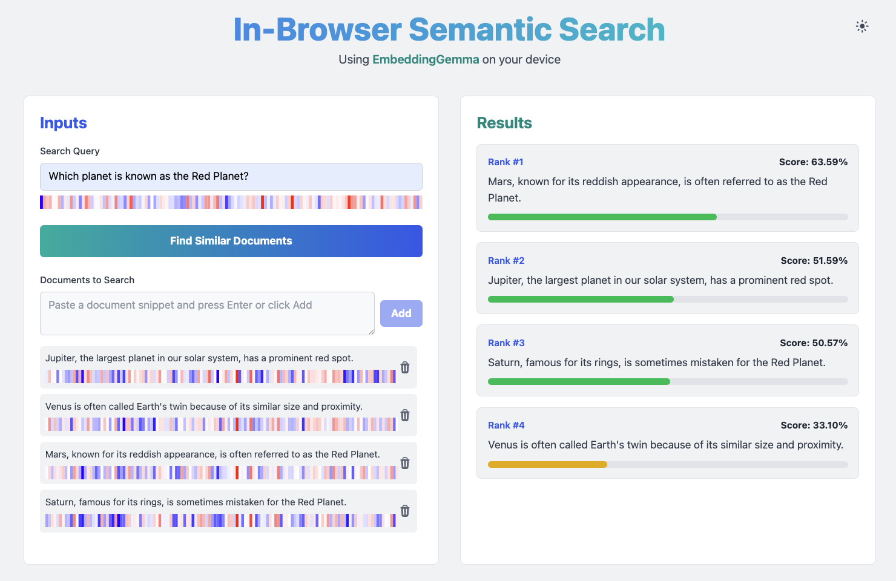

# In-browser Semantic Search with EmbeddingGemma

This project demonstrates how to use a Gemma model variant for semantic search directly in the browser using [Transformers.js](https://huggingface.co/docs/transformers.js/index), without using a remote server or sending any data remotely.
We are specifically using the `EmbeddingGemma` model, as explained in this HuggingFace [blog post](https://huggingface.co/blog/embeddinggemma#transformersjs).

From the blog post:
> Today, Google releases EmbeddingGemma, a state-of-the-art multilingual embedding model perfect for on-device use cases. Designed for speed and efficiency, the model features a compact size of **308M parameters** and a **2K context window**, unlocking new possibilities for mobile RAG pipelines, agents, and more. EmbeddingGemma is trained to support over **100 languages** and is the highest-ranking text-only multilingual embedding model under 500M on the Massive Text Embedding Benchmark (MTEB) at the time of writing.



## How it works

This application allows you to perform semantic search on a collection of documents. Here's how to use it:

1.  **Add Documents:** Start by adding the documents you want to search through in the "Documents" section.
2.  **Enter a Query:** Type your search query in the "Query" input field.
3.  **Find Similar Documents:** Click the "Find similar documents" button. The application will then compute the embeddings for your query and all the documents. The documents will be ranked by their semantic similarity to the query.

### Embedding Visualization

After the search is complete, you will see a visualization of the embedding vectors for the query and each document. The vectors are represented by a grid of blue and red squares, where blue indicates a positive value and red indicates a negative value.

This visualization only shows the first 128 values of each embedding vector. This is because `EmbeddingGemma` is a Matryoshka model, which means its embeddings can be truncated to a smaller dimension with only a small cost in accuracy. By focusing on the first 128 values, we can still get a good measure of similarity while keeping the visualization and computation manageable.

## Setting up the model

The embedding model files are not included in this repository due to their size. You have two options to run this application: using a local model or a remote model from the Hugging Face Hub.

### Option 1: Using a local model (default)

1.  **Download the model files:**
    Download the model files from the Hugging Face repository: [onnx-community/embeddinggemma-300m-ONNX](https://huggingface.co/onnx-community/embeddinggemma-300m-ONNX/tree/main). You will need to download all the files from the repository.

2.  **Place the model files:**
    Create a `public/model` directory in the root of this project and place all the downloaded model files inside it.

3.  **Configuration:**
    The application is configured to use a local model by default. In `services/embeddingService.ts`, you should see the following configuration:

    ```typescript
    env.allowLocalModels = true;
    env.allowRemoteModels = false;

    const MODEL_ID = "/model/";
    ```

### Option 2: Using a remote model

If you prefer not to download the model files locally, you can configure the application to fetch the model from the HuggingFace Hub at runtime.

1.  **Configuration:**
    Open `services/embeddingService.ts` and modify the configuration as follows:

    ```typescript
    // env.allowLocalModels = true; // Before
    // env.allowRemoteModels = false; // Before
    // const MODEL_ID = "/model/"; // Before

    env.allowLocalModels = false; // After
    env.allowRemoteModels = true; // After
    const MODEL_ID = "onnx-community/embeddinggemma-300m-ONNX"; // After
    ```

    This will instruct Transformers.js to download the model from the specified Hugging Face repository.

## License

This project is licensed under the [Apache License, Version 2.0](LICENSE).

## Disclaimer

This is not an official Google product.